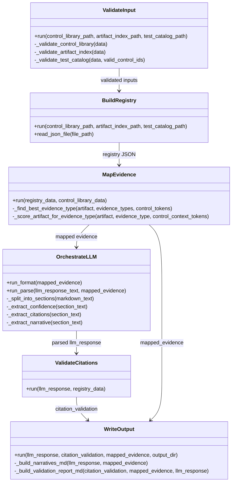
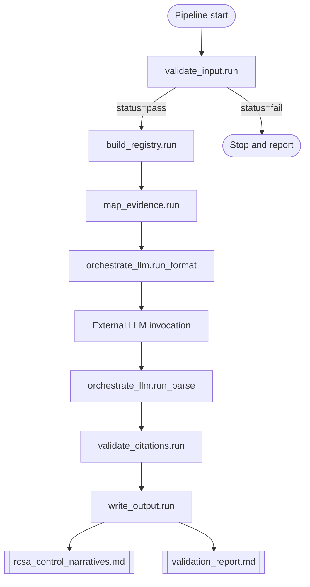

# Architecture Overview

The repository contains an RCSA Control Narrative Generation skill centered on `.cursor/skills/rcsa/SKILL.md`, with Python scripts implementing deterministic data validation, registry construction, evidence mapping, citation validation, and final markdown output, while LLM reasoning is mediated by `orchestrate_llm.py`; assets (sample control library, sample artifact index, sample test catalog, citation spec, and templates) are present but path conventions and step responsibilities show drift between the spec and implementation.

## Repository Structure

| File | Summary |
|------|---------|
| `.cursor/skills/rcsa/SKILL.md` | Canonical 6-step workflow spec (4 script steps + 2 LLM steps) and output requirements. |
| `.cursor/skills/rcsa/scripts/validate_input.py` | Step 1 validator for control library, artifact index, and test catalog JSON files. |
| `.cursor/skills/rcsa/scripts/build_registry.py` | Step 2 registry builder for artifacts/tests and reverse `file_path_index`. |
| `.cursor/skills/rcsa/scripts/map_evidence.py` | Step 3 evidence mapper from registry entries to controls with gap flags. |
| `.cursor/skills/rcsa/scripts/orchestrate_llm.py` | Step 4 helper: format prompt for LLM and parse markdown response back to JSON. |
| `.cursor/skills/rcsa/scripts/validate_citations.py` | Step 5 citation parser/resolver using `[file_path — description]` pattern. |
| `.cursor/skills/rcsa/scripts/write_output.py` | Step 6 deterministic output writer for `rcsa_control_narratives.md` and `validation_report.md`. |
| `.cursor/skills/rcsa/assets/sample_control_library.json` | Demo control library with 4 controls (`AC`, `CM`, `DQ`, `IH`) and evidence types. |
| `.cursor/skills/rcsa/assets/sample_artifact_index.json` | Demo artifact catalog (15 artifacts). |
| `.cursor/skills/rcsa/assets/sample_test_catalog.json` | Demo test catalog (8 tests with `controls_relevant`). |
| `.cursor/skills/rcsa/assets/rcsa_control_narratives_template.md` | Narrative template asset from F4. |
| `.cursor/skills/rcsa/validation_report_template.md` | Validation report template asset from F4 (stored at skill root, not `assets/`). |
| `.cursor/skills/rcsa/assets/citation_format.md` | Citation grammar and resolution rules for inline evidence citations. |
| `rcsa_control_narratives.md` | Existing generated narrative output artifact at repo root. |
| `validation_report.md` | Existing generated validation report artifact at repo root. |
| `Synchronyproject/Docs/specs/f4-rcsa-assets/...` | F4 asset specs/contracts plus duplicate sample-data bundle used as design reference. |
| `Synchronyproject/Docs/specs/f5-skill-rcsa-control-narratives/...` | F5 spec package that defines SKILL behavior and acceptance goals. |
| `Synchronyproject/Docs/specs/f6-rcsa-scripts/...` | F6 script contracts/quickstart; references tests and paths not fully implemented in repo. |

## System Architecture

```mermaid
graph TD
  A[Step 1: validate_input.py<br/>Inputs: control_library + artifact_index + test_catalog] --> B[Step 2: build_registry.py<br/>Output: registry{artifacts, tests, file_path_index}]
  B --> C[Step 3: map_evidence.py<br/>Output: mappings + coverage + gap_flag]
  C --> D[Step 4a: orchestrate_llm.py --mode format<br/>Output: LLM prompt text]
  D --> E[LLM reasoning outside script runtime<br/>Output: markdown narratives]
  E --> F[Step 4b: orchestrate_llm.py --mode parse<br/>Output: structured llm_response JSON]
  F --> G[Step 5: validate_citations.py<br/>Output: citation_validation]
  G --> H[Step 6: write_output.py<br/>Writes final markdown files]
  H --> I[rcsa_control_narratives.md]
  H --> J[validation_report.md]
```

## Key Modules

### rcsa_skill_spec

`.cursor/skills/rcsa/SKILL.md` defines the intended 6-step orchestration, anti-hallucination constraints, confidence rubric, citation format rules, and required output structure. It is the source specification but does not exactly match implementation contracts in several places (paths, data shapes, and Step 6 ownership).

### deterministic_pipeline_scripts

The core deterministic layer is implemented in `validate_input.py`, `build_registry.py`, `map_evidence.py`, `validate_citations.py`, and `write_output.py`. The scripts operate on pre-structured JSON metadata rather than raw repository scanning and snippets. Intermediate outputs are JSON objects passed across steps.

### llm_bridge_layer

`orchestrate_llm.py` is a bridge module: format mode creates a strict prompt from mapped evidence, and parse mode normalizes LLM markdown into `llm_response`. The actual LLM call is external to scripts.

### data_and_asset_fixtures

RCSA asset fixtures exist under `.cursor/skills/rcsa/assets/` (control library, artifact index, test catalog, citation format, narrative template) plus `validation_report_template.md` at skill root. A duplicate F4 sample-data package exists under `Synchronyproject/Docs/specs/f4-rcsa-assets/...`.

### tests_and_sample_repos

Sample JSON fixtures are present and usable. Existing output examples (`rcsa_control_narratives.md`, `validation_report.md`) provide end-state fixtures. No dedicated script unit test files (`test_validate_input.py`, etc.) are present, and no concrete sample codebase contains the artifact/test files named in the JSON fixture paths.

### implementation_drift_vs_skill_md

Drift identified from `SKILL.md` to implementation:
- Step 1 spec says validate control library + raw repository listing; script validates three JSON fixtures and does not parse raw repo listing.
- Step 2 spec expects snippet extraction and `snippet_line_range`; script builds metadata registry only (no snippets).
- [RESOLVED] Step 3 multi-control mapping is now implemented in `map_evidence.py` via `artifact_matches`, using `ABSOLUTE_SCORE_THRESHOLD = 2` and `RELATIVE_SCORE_WINDOW = 1` retention rules to keep meaningful near-best matches across controls.
- Step 4 spec relies on snippet-as-ground-truth logic; runtime has no snippet payload to enforce this.
- Step 5 spec output shape differs from script output keys and nesting.
- Step 6 spec describes LLM assembly; implementation uses deterministic `write_output.py`.
- Asset path references in `SKILL.md` are inconsistent with actual storage (`assets/` vs root, and `validation_report_template.md` location split).

### unimplemented_spec_claims

Notable spec claims that are not implemented or not enforceable in current code:
- Script failure exit semantics in docs/quickstart do not match `validate_input.py` behavior (`sys.exit(0)` even on fail).
- Template-driven output claim is weakly implemented: templates exist but `write_output.py` composes markdown directly and does not read template files.
- Citation-fix loop claim ("fix unresolved before Step 6") is procedural in spec but not automated by scripts.
- "All controls always mapped with direct/indirect relevance rubric" is not represented in `map_evidence.py` output schema.
- Required unit test suite referenced in F6 docs is absent in repository.

## Hotspots

| File | LOC | Functions | Imports | Fan-in | Fan-out | Reason |
|------|-----|-----------|---------|--------|---------|--------|
| `.cursor/skills/rcsa/SKILL.md` | 533 | N/A | N/A | High | High | Central contract with multiple drift points against scripts/assets. |
| `.cursor/skills/rcsa/scripts/orchestrate_llm.py` | 371 | 9 | 5 | High | High | Dual-mode parser/formatter plus degraded-mode branching and schema shaping. |
| `.cursor/skills/rcsa/scripts/write_output.py` | 321 | 7 | 5 | Medium | High | Final assembly logic diverges from template-driven and Step 6 LLM wording. |
| `.cursor/skills/rcsa/scripts/map_evidence.py` | 282 | 8 | 4 | Medium | Medium | Heuristic scoring logic and one-to-one artifact assignment impacts evidence semantics. |
| `.cursor/skills/rcsa/scripts/validate_input.py` | 259 | 6 | 4 | Medium | Medium | Gatekeeper validation plus exit-code mismatch with documented behavior. |
| `.cursor/skills/rcsa/assets/sample_artifact_index.json` | 99 | N/A | N/A | Medium | Low | Primary fixture for citation/path mapping; no backing repository files exist for listed paths. |

## Diagrams

### Class Diagram



### Call Graph


